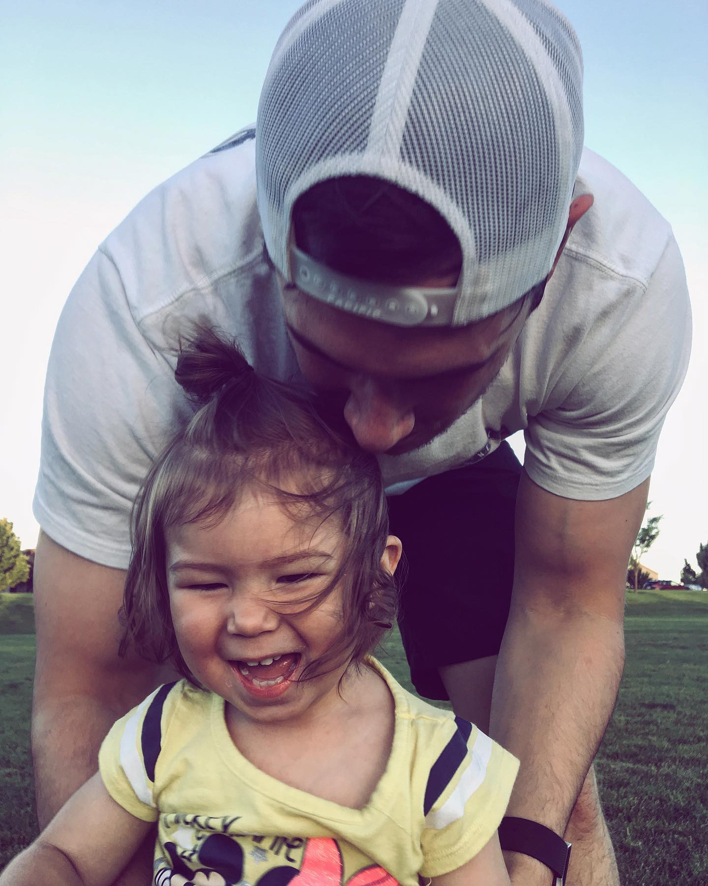

# Tyler's Responsive Portfolio

This is my personal portfolio which will showcase who I am as well as projects I have built. There is a contact form where you can reach out to me. This portfolio was created with Bootstrap for responsive design.

          

## Getting Started

These instructions will get you a started with how to build a responsive portfolio.

### Prerequisites

```
Text editor of your choosing, internet connection
```

### Installing

```
1. Create a folder directory called 'responsive-portfolio'.
2. Inside folder, create 3 files (index.html, contact.html, portfolio.html).
3. Inside responsive-portfolio create folder directory called 'assests';
4. Inside assets folder create two folders called 'css' and 'images'.
4. Your images folder will be where you will keep all images for the website.
5. Inside the css folder create a file named style.css. This is the file where you will create your css.
6. Add README.md file if you would like.

```

## Built With
```
* HTML
* CSS
* Bootstrap framework

```

### Links to Wesbsite 

```
View my portfolio here
https://mr-tyler31.github.io/Responsive-Portfolio/


